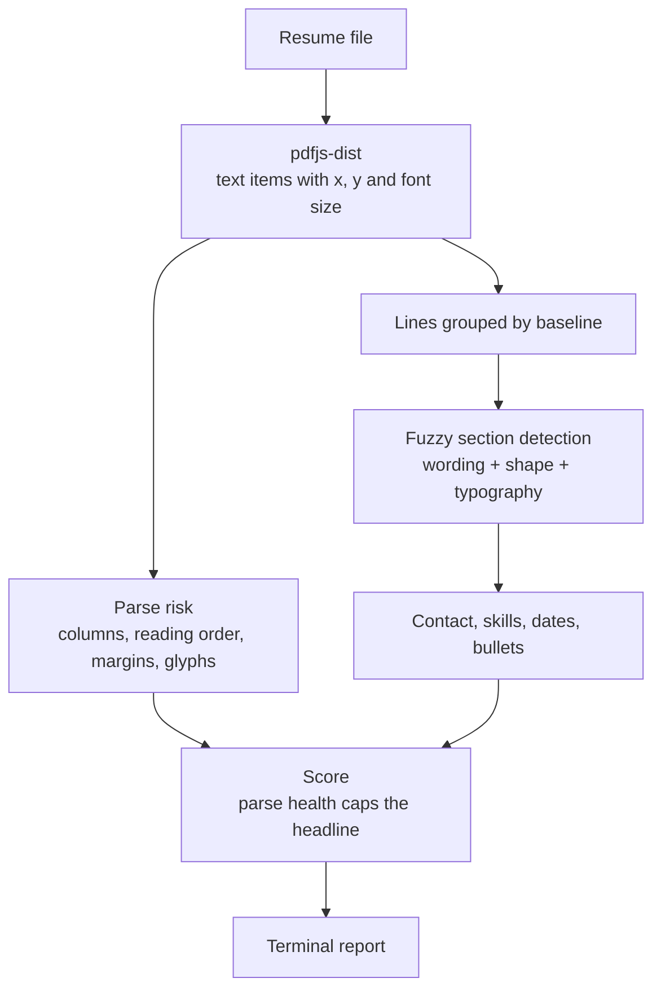

# ATS Readiness Scoring

Scores a resume out of 100 without a job description and without a language model. The same file always produces the same number.

The score answers one question: **if this file goes into an applicant tracking system, will the system read it correctly, and will a recruiter skimming the result see anything worth reading?**

## The three things it measures

A single number hides which problem you have, so the score is built from three separate ones.

| Sub-score | Question | How it is answered |
|---|---|---|
| **Parse health** | Will an ATS extract the fields correctly? | Page geometry: columns, reading order, margins, font decoding |
| **Completeness** | Are the expected fields present and findable? | Fuzzy section detection and contact extraction |
| **Content strength** | Is the writing worth reading? | Bullet-level rules on measurement, verbs and length |

Parse health **caps** the headline score rather than averaging into it. A two-column PDF whose job titles get interleaved is broken no matter how well it is written, and a weighted average would hide that.

```
headline = min(0.45 × completeness + 0.55 × content strength, parse health)
```

## Pipeline



## Parse risk

This is the part that needs the geometry, and the part a text-only checker cannot do.

| Check | Weight | What it catches |
|---|---:|---|
| Text layer an ATS can read | 30 | A scanned or image-only PDF, where a parser reads nothing |
| Single-column layout | 25 | A sidebar template; parsers read across the gutter and interleave the columns |
| Stored order matches visual order | 20 | A file where two parsers will disagree about what it says |
| Nothing stranded in header or footer | 10 | Contact details in the page margin, which several parsers discard |
| Characters decode to real text | 10 | A font embedded without a character map, stored as mojibake |
| Word spacing survived extraction | 5 | Extraction that lost the space glyph and ran words together |

**Stored order versus visual order** is the check worth explaining. Every page is extracted twice: once in the order the PDF stores its text, and once in the order the page is read in, sorted by position. The edit distance between the two is how far a parser can drift. Agreement means any parser gets the same answer; divergence means the file is a coin toss.

A check that cannot run says so. DOCX and TXT carry no geometry to inspect, so those checks report `unchecked` and drop out of the average instead of scoring as clean — the report prints how many of the six actually ran.

## Section detection

Headings are matched on wording, shape and typography together, not against a fixed list of strings. `WORK HISTORY`, `EMPLOYMENT`, `Relevant Work Experience` and a misspelled `EXPERENCE` all resolve to the experience section, and `EXPERIENCE Acme Corp, Senior Engineer` — which is how PDF extraction usually delivers a heading — keeps both the heading and its content.

The guard that makes this safe is that a line only splits when it still looks like a heading. `Experience with Kubernetes and Terraform` is a bullet, and stays one.

## Usage

```bash
npm install
node index.js resume.pdf
node index.js resume.docx --json
```

## Reliability

`npm test` runs the suite. Beyond the unit tests, four properties are asserted directly, because a score nobody can reproduce is not a score:

- **Test-retest** — the same file scored twice returns an identical result, for both TXT and PDF.
- **Perturbation invariance** — renaming every heading, reordering every section, or exporting the same content as a PDF instead of a text file does not move the score.
- **Discrimination** — a strong resume, a middling one, a keyword-stuffed one and a two-column one rank in that order, with at least 8 points between each tier.
- **Time invariance** — nothing that feeds the score reads the clock. Employment gaps are measured between roles, never up to today, so a resume does not quietly drift downwards while it sits in a drawer.

## What it deliberately does not do

- **No job description matching.** The score is about the resume alone.
- **No LLM.** Every number comes from a rule you can read in `src/domain/`.
- **No OCR.** A scanned resume is reported as unreadable, which is the honest answer.
